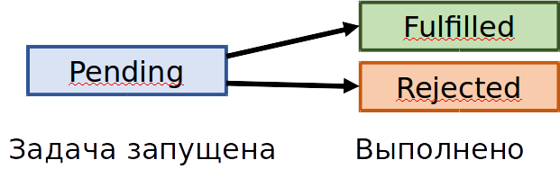

# Почему Promise/A+?

## Почему не простой callback?

Казалось бы, что проще: написать метод для запуска асинхронной операции, который принимает callback:

```cpp
class IServerApi
{
public:
    using LoginCallback = std::function<void(const UserInfo &)>;

    virtual ~IServerApi() = default;
    virtual void Login(const string &name, const string& password, const LoginCallback &callback) = 0;
};
```

Но что будет, если в асинхронной операции логина произойдёт одна из перечисленных ошибок?

- нет интернета и запрос не прошёл
- имя домена не найдено
- 501 Internal Server Error
- 403 Bad Request
- и так далее

Очевидно, что колбек не будет вызван, т.к. не существует допустимого UserInfo. Если callback следует вызывать при любом результате, можно его видоизменить:

```cpp
class IServerApi
{
public:
    using LoginCallback = std::function<void(const optional<UserInfo> &)>;

    virtual ~IServerApi() = default;
    virtual void Login(const string &name, const string& password, const LoginCallback &callback) = 0;
};
```

В новой реализации в случае успеха колбек будет вызван с непустым optional, а в случае ошибки &mdash; с пустым.

Но и здесь кроется проблема: что, если разные типы ошибок обрабатываются по-разному? Например:

- если HTTP-код не удалось получить, пользователь получает уведомление с просьбой исправить проблемы с сетью
- если HTTP-код из серии 403 Bad Request, пользовател получает уведомление о неправильной паре логин-пароль

Приходится кроме LoginCallback передавать ещё один колбек, вызываемый при ошибке:

```cpp
class IServerApi
{
public:
    using LoginSucceedCallback = std::function<void(const UserInfo &)>;
    using LoginFailedCallback = std::function<void(const std::exception_ptr &)>;

    virtual ~IServerApi() = default;
    virtual void Login(const string &name, const string& password, const LoginSucceedCallback &onSuccess, const LoginFailedCallback &onFailed) = 0;
};
```

Недостатки такого решения:

- постоянно передаются два callback, выражающих завершение одной операции
- иногда второй callback будет пустым, либо ему можно дать пустое значение по-умолчанию, но сделать это придётся явно
- важный, но неприметный недостаток: трудно выполнять *продолжение* (англ. continuation) асинхронной операции

## Продолжение (continuation) операции

Пусть у нас есть класс Utils, имеющий две операции:

```cpp
class Utils
{
public:
    using StringCallback = std::function<void(const string &)>;
    using ErrorCallback = std::function<void(const exception_ptr &)>;

    static void LoadFileAsync(const path &filepath, const StringCallback &onSuccess, const ErrorCallback &onError);
    static XmlDocumentCallback ParseXml(const string &content);
};
```

Давайте склеим две операции, асинхронную и синхронную, в новую асинхронную операцию. Выберем наивный путь (которым пойдёт большинство разработчиков в крупной команде):

```cpp
using XmlDocumentCallback = std::function<void(const XmlDocument &)>;

// ! плохой код !
void LoadXmlAsync(const path &filepath, const XmlDocumentCallback &onSuccess, const ErrorCallback &onError)
{
    Utils::LoadFileAsync(filepath, [=](const string &content) {
        onSuccess(Utils::ParseXml(content));
    }, onError);
}
```

Есть проблема: если ParseXml выбросит исключение, оно не будет передано в колбек `onError`. Такую ошибку легко допустить и трудно заметить. Это важный и далеко не единственный аргумент против колбеков onSucess/onError.

## Promise/A+ в Javascript

Вместо того, чтобы принимать колбеки, метод для запуска асинхронной задачи мог бы вернуть объект Promise, позволяющий подписаться на результаты/ошибки отложенно и имеющий всего три крайне полезных свойства:

- у Promise есть методы then/catch, т.е. можно повесить колбек на успешное завершение и на ошибку (по выбору или оба сразу)
- повешенный на then/catch колбек вызывается с чистым стеком на определённом потоке (т.е. как новый task)
- Promise работает как автомат и может находиться строго в одном из трёх состояний (ожидание, завершено со значением, завершено с исключением), из которых два состояния являются конечными.



Promise/A+ &mdash; это спецификация из языка Javascript, которая описывает принципы работы подобной сущности Promise. Спецификация крайне гибкая, например, она позволяет решить задачу с конвейером из трёх операций (чтение из файла, разбор XML и построение игрового уровня) таким простым способом:

```js
function loadGameMap() {
    let contentPromise = utils.loadUrlAsStringAsync("/res/level1.tmx");
    let xmlPromise = contentPromise.then((content) => {
        // Если parseXmlString будет синхронной и вернёт значение,
        //  поток конечно же подвиснет, а Promise перейдёт в fulfilled state
        //  с переданным значением.
        // Если parseXmlString вернёт такой же Promise, он будет поглощён
        //  методом then, и разбор XML протечёт полностью асинхронно.
        return utils.parseXmlString(content)
    });
    let mapPromise = xmlPromise.then((xmlDocument) => {
        return utils.buildGameMap(xmlDocument)
    });
    return mapPromise;
};
```
